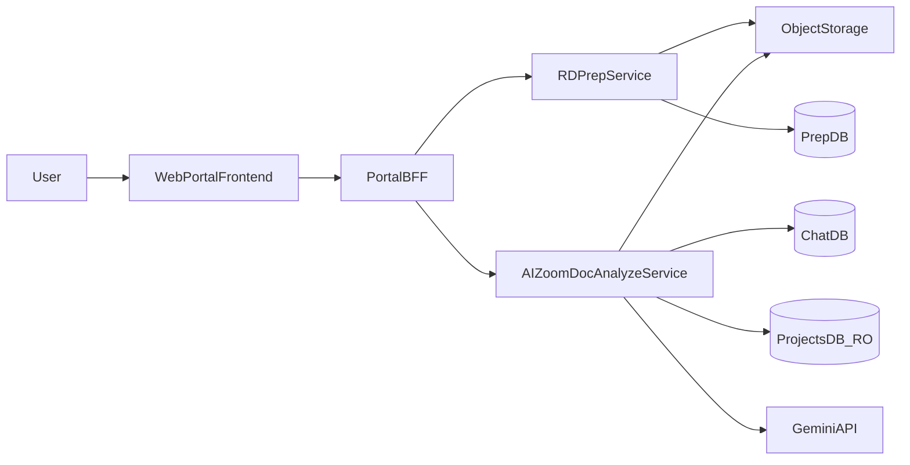

# Техническое задание (ТЗ)
# Портал RD (подготовка документации) + AIZoomDoc (LLM‑анализ)

## 1. Введение

### 1.1. Назначение документа
Настоящее ТЗ описывает требования к работам по **аудиту, исправлению дефектов, архитектурной оптимизации (при необходимости) и реализации улучшений** для двух контуров системы, а также к их интеграции в **единый web‑портал**.

### 1.2. Термины и сокращения
- **RD / контур подготовки** — подготовка документации: разметка PDF, OCR/описание изображений, экспорт артефактов.
- **AIZoomDoc / контур анализа** — чат‑анализ подготовленных артефактов с помощью LLM (Gemini), запрос изображений/zoom.
- **Portal** — единый web‑интерфейс для обоих контуров.
- **BFF (Backend‑For‑Frontend)** — единая серверная точка входа для web‑клиента (агрегация и маршрутизация запросов).
- **Viewport** — кроп с контекстом (вокруг целевой зоны).
- **Zoom** — кроп повышенной детализации по координатам.
- **Block** — блок на странице PDF: `TEXT`, `TABLE`, `IMAGE`.
- **MD/HTML/JSON артефакты** — результат подготовки документа, используемый контуром анализа.

## 2. Исходные данные и текущее состояние

### 2.1. Исходные репозитории/проекты
- **RD (desktop)**: `C:\Users\postoev.e.v\CursorProjects\RD`
  - Текущее: Python 3.11, PySide6 GUI, разметка блоков, OCR (Local VLM/Chandra), автосегментация (Marker/Datalab/эвристики), удаление штампов, экспорт в Markdown.
- **AIZoomDoc v1 (legacy)**: `C:\Users\postoev.e.v\CursorProjects\aizoomdoc\aizoomdoc`
  - Текущее: поисковый движок по `result.md`, обработка изображений/zoom, Gemini SDK, парсинг tool calls.
- **AIZoomDoc v2 (client‑server MVP)**: текущий репозиторий `aizoomdoc-server`
  - Текущее: FastAPI + Supabase + S3/R2 + Gemini; часть сервисов (search/image/tool calls/WS streaming) содержит TODO и требует доведения до функционала v1.

### 2.2. Важное уточнение: решения уже рабочие (не “с нуля”)
Оба контура рассматриваются как **эксплуатируемые рабочие решения**:
- имеются **работоспособные серверные компоненты**;
- имеются **настроенные фоновые процессы/обработка очередей** для длительных операций (обработка документов, OCR/распознавание, генерация артефактов и т.п.);
- задача работ — **ревью, исправления, оптимизация и эволюционное развитие** без деградации текущей работоспособности и производительности.

### 2.3. Принципиальный текущий data‑flow
1) Пользователь размечает PDF и запускает OCR → получает MD/HTML/JSON + изображения/кропы.  
2) Пользователь задаёт вопрос → контур анализа использует подготовленные артефакты, при необходимости запрашивает изображения и zoom‑фрагменты → выдаёт ответ.

## 3. Цели и границы работ

### 3.1. Цели
- Создать **единый web‑портал** с модулем подготовки (RD‑web) и модулем анализа (AIZoomDoc‑web).
- Провести **аудит** существующих решений, выявить и классифицировать дефекты/риски.
- Реализовать согласованные исправления/улучшения, довести до production‑качества ключевые сценарии.
- Стандартизировать **контракты данных** между подготовкой и анализом.
- Сохранить и укрепить текущую эксплуатацию: **не ухудшить** существующую пропускную способность очередей/воркеров и время обработки типовых документов.

### 3.2. Целевое разбиение на сервисы (фиксируется как целевое)
Система проектируется как **2 независимых backend‑сервиса + BFF**:
- **RD‑prep service** — подготовка документа (разметка, OCR, экспорт, фоновые задачи).
- **AIZoomDoc‑analyze service** — чат/LLM‑анализ, поиск, request_images/zoom, хранение истории.
- **Portal BFF/API Gateway** — единая точка входа для web‑клиента.

### 3.3. Не входит в обязательный объём (может быть опционально)
- SLA‑поддержка после гарантийного периода (может быть предложена отдельно).
- Переписывание legacy‑данных/архивов без подтверждённой необходимости.
- Полное объединение сервисов в монолит (рассматривается как альтернатива на обследовании, но не как целевая схема).

## 4. Целевая архитектура (верхний уровень)

### 4.1. Компоненты
- **WebPortalFrontend**: единое web‑приложение.
- **PortalBFF**: авторизация, маршрутизация, агрегация (единая API‑поверхность для фронта).
- **RDPrepService**: файловый pipeline подготовки (PDF→страницы→кропы→OCR→MD/HTML/JSON), управление задачами.
- **AIZoomDocAnalyzeService**: чат, история, поиск по подготовленным данным, изображения/zoom, интеграция Gemini.
- **ObjectStorage (S3/R2)**: хранение PDF, изображений страниц, кропов, результатов OCR.
- **DB**: (минимум) базы для пользователей/чата/настроек/промптов и базы проектов (read‑only).

### 4.2. Диаграмма

## 5. Требования к данным и контрактам между контурами

### 5.1. Единый “пакет результата подготовки” (PreparedDocumentPackage)
Контур RD‑prep должен формировать результаты в стандартизированном виде, чтобы контур анализа мог работать без “знания” внутренних деталей RD.

**Обязательные артефакты пакета:**
- `document.pdf` (оригинал или ссылка)
- `annotations.json` — геометрия и метаданные блоков
- `result.md` — структурированный Markdown (по страницам, содержит описание IMAGE блоков + ссылки на кропы)
- `ocr.html` (опционально, если используется html‑OCR формат)
- `images/` (или `pages/`) — изображения страниц (preview/full при необходимости)
- `crops/` — кропы блоков, включая изображения, используемые в MD

**Требование**: каждый блок должен иметь стабильный `block_id`, используемый и в `annotations.json`, и в тексте/ссылках, чтобы анализ мог ссылаться на источник.

### 5.2. Формат `annotations.json` (минимальный)
Минимально необходимая структура (может расширяться, но не ломать обратную совместимость):
- `pdf_path` или `document_id`
- `pages[]`:
  - `page_index`
  - `width`, `height` (размеры страницы в пикселях для системы координат)
  - `blocks[]`:
    - `id` (UUID/строка)
    - `page_index`
    - `coords_px` \([x1,y1,x2,y2]\)
    - `coords_norm` \([x1,y1,x2,y2] 0..1\)
    - `block_type`: `text|table|image`
    - `source`: `user|auto`
    - `category` (группа/описание)
    - `image_file` (путь/ключ к кропу)
    - `ocr_text` (результат OCR/описание)

### 5.3. Формат `result.md`
Требования:
- Разделение по страницам: `# Страница N`.
- Блоки отсортированы сверху вниз.
- Для `IMAGE` блоков: **описание + ссылка на кроп** (относительный путь или ссылка через storage).
- Для `TABLE` блоков: таблица в Markdown (если возможно) или структурированный текст.
- Для `TEXT` блоков: структурированный текст.

### 5.4. Контракт tool calls между LLM и сервером анализа
Контур анализа должен поддерживать минимум следующие tool calls:
- `request_images`: запрос изображений по `image_ids`/`block_id`
- `zoom`: запрос zoom по `image_id` + `coords_norm` или `coords_px`
- `request_documents`: запрос дополнительной документации/листов (опционально)

**Требование**: tool calls должны быть **строго JSON** и валидироваться схемой (чтобы устранить хрупкий парсинг “JSON из текста”).

## 6. Функциональные требования: Portal (web‑frontend)

### 6.1. Общие требования портала
- Единая навигация по модулям: **Подготовка (RD)** / **Анализ (AIZoomDoc)**.
- Единая библиотека проектов/документов (минимум: список, поиск, фильтры).
- Единая авторизация и права доступа (см. раздел 9).

### 6.2. Модуль RD‑web (подготовка)
#### 6.2.1. Просмотр PDF
- Загрузка/выбор PDF, отображение страниц, быстрый скролл.
- Масштабирование (zoom), панорамирование.
- Отображение блоков поверх PDF (оверлеи).

#### 6.2.2. Разметка блоков
- Создание/редактирование/удаление блоков прямоугольником.
- Типы: `TEXT`, `TABLE`, `IMAGE`.
- Поля: категория/описание, комментарии, группировка (если требуется).
- Импорт/экспорт `annotations.json`.
- Поддержка нормализованных координат для устойчивости при смене DPI/рендеринга.

#### 6.2.3. Автосегментация
- Запуск автосегментации по странице/всему документу.
- Источники (возможны несколько):
  - локальный алгоритм (OpenCV эвристики),
  - Marker,
  - Datalab API (асинхронная задача).
- Политика конфликтов: авто‑блоки не должны разрушать ручную разметку; требуется механизм merge/override.

#### 6.2.4. OCR/распознавание по типам блоков
- Режим “по блокам”:
  - `TEXT`: OCR (VLM/Chandra)
  - `TABLE`: OCR (VLM/Chandra) с выводом в Markdown
  - `IMAGE`: VLM‑описание изображения на русском + извлечение текста/параметров
- Режим “вся страница” (опционально): полный OCR документа.
- Настраиваемые промпты OCR через файловую/БД‑конфигурацию.
- Прогресс и возобновление задач (перезапуск не должен портить уже готовые блоки).

#### 6.2.5. Удаление электронных штампов (как web‑функция)
- Просмотр структуры PDF (аннотации/изображения/контейнеры).
- Выбор элементов на странице и “выбрать похожее на всех страницах”.
- Предпросмотр результата и сохранение очищенного PDF как нового артефакта.

#### 6.2.6. Экспорт результатов
- Генерация `result.md` из блоков (структурированный документ).
- Сохранение кропов (`crops/`) и изображений страниц (`pages/`).
- Экспорт пакета `PreparedDocumentPackage` в Object Storage.

### 6.3. Модуль AIZoomDoc‑web (анализ)
- Чат с историей, создание/список чатов.
- Прикрепление документов/результатов (PreparedDocumentPackage или ссылки на него).
- Streaming ответа (WebSocket/SSE).
- Отображение событий pipeline: search, processing, llm, zoom.
- Просмотр запрошенных изображений/zoom внутри чата (галерея + ссылки на источники).
- Выбор роли (промпт роли) и режима модели (simple/complex).

## 7. Функциональные требования: backend‑сервисы

### 7.1. RD‑prep service (backend)

#### 7.1.1. Назначение сервиса
RD‑prep service реализует серверную часть подготовки документа:
- приём PDF, хранение и версионирование;
- рендер страниц (preview/full);
- хранение/редактирование разметки (`annotations.json`);
- генерация кропов блоков;
- выполнение OCR/описаний изображений (по типам блоков);
- экспорт пакета `PreparedDocumentPackage` в Object Storage;
- управление долгими задачами (очередь/воркеры).

#### 7.1.2. Хранилище и сущности
Минимальные сущности:
- **Project** (опционально, если в портале предусмотрено управление проектами подготовки)
- **Document** (PDF, метаданные, версии)
- **PreparationJob** (тип: render/segmentation/ocr/export/stamp_removal)
- **Artifact** (result.md, ocr.html, annotations.json, crops, pages)

#### 7.1.3. API (минимальный контракт; допускаются уточнения на Discovery)
- **Документы**
  - `POST /prep/documents` — загрузка PDF (или регистрация внешней ссылки)
  - `GET /prep/documents` — список документов (фильтры/поиск)
  - `GET /prep/documents/{id}` — метаданные
  - `GET /prep/documents/{id}/pages/{page}/preview` — превью страницы
  - `GET /prep/documents/{id}/pages/{page}/full` — полноразмерный рендер (по необходимости)
- **Разметка**
  - `GET /prep/documents/{id}/annotations` — получить `annotations.json`
  - `PUT /prep/documents/{id}/annotations` — сохранить `annotations.json` (версионирование)
- **Автосегментация**
  - `POST /prep/documents/{id}/jobs/segmentation` — запуск автосегментации (страница/весь документ, backend=opencv|marker|datalab)
- **OCR**
  - `POST /prep/documents/{id}/jobs/ocr` — запуск OCR (mode=blocks|full_document; backends для TEXT/TABLE/IMAGE)
- **Удаление штампов**
  - `POST /prep/documents/{id}/jobs/stamp_removal` — запуск анализа структуры PDF/удаления элементов (или интерактивный режим через UI)
- **Экспорт**
  - `POST /prep/documents/{id}/jobs/export` — генерация/публикация `PreparedDocumentPackage`
  - `GET /prep/documents/{id}/package` — ссылки на артефакты пакета
- **Jobs**
  - `GET /prep/jobs/{job_id}` — статус/прогресс/ошибки
  - `GET /prep/jobs/{job_id}/logs` — логи выполнения (если предусмотрено)

#### 7.1.4. Очереди и фоновые задачи
Требования:
- Долгие операции (OCR, рендеринг большого PDF, Datalab) выполняются **асинхронно** (очередь задач + воркеры).
- Должны быть доступны: прогресс, отмена (если возможно), ретраи, идемпотентность (без порчи уже готовых артефактов).

### 7.2. AIZoomDoc‑analyze service (backend)

#### 7.2.1. Назначение сервиса
Сервис анализа реализует:
- аутентификацию/авторизацию;
- управление чатами и историей;
- поиск по подготовленным артефактам;
- выдачу изображений/zoom (кропы) по запросу LLM;
- интеграцию с Gemini (simple/complex профили);
- streaming ответа и событий pipeline.

#### 7.2.2. Требование: доведение MVP v2 до функционала
В текущем MVP v2 необходимо реализовать/довести:
- **WebSocket streaming** с аутентификацией, реализация событий `phase_*`, `llm_token`, `tool_call`, `llm_final`.
- **SearchService**: портирование логики поиска по `result.md` + использование `annotations.json`/`ocr.html` и ранжирование.
- **ImageService**: viewport/zoom/quadrants, работа с PDF/изображениями, сохранение в S3/R2.
- **LLMService**: строгий JSON‑контракт ответов, парсинг tool calls, поддержка `flash_extractor` + Pro stage, per‑user ключи.
- **AgentService**: оркестрация (search → context → LLM → tool calls → финал), сохранение событий и артефактов.

#### 7.2.3. API (ориентир по текущему серверу)
Базовый набор, который должен быть реализован и стабилизирован:
- Auth: `POST /auth/exchange` (в MVP), дальнейшее усиление — см. раздел 9
- User: `GET /me`, `PATCH /me/settings`
- Prompts: `GET /prompts/roles`
- Chats: `POST /chats`, `GET /chats`, `GET /chats/{chat_id}`, `POST /chats/{chat_id}/messages`, `WS /chats/{chat_id}/stream`
- Files: `POST /files/upload`, `GET /files/{id}`
- Projects (read‑only): `GET /projects/tree`, `GET /projects/documents/{doc_id}/results`, `GET /projects/search`

### 7.3. Portal BFF / API Gateway

#### 7.3.1. Назначение
BFF предоставляет фронту единый API, инкапсулирует различия сервисов и обеспечивает:
- единый вход (auth), выдачу токенов/сессий;
- маршрутизацию вызовов к RD‑prep и AIZoomDoc‑analyze;
- объединённые модели (Project/Document/Chat) для UI;
- единые ошибки/стандарты ответов.

#### 7.3.2. Требования
- Единый формат ошибок (error_code, message, trace_id).
- Версионирование API (`/api/v1/...`).
- Лимиты и защита от “шумных” клиентов (rate limiting).

## 8. Требования к аудиту/ревью и результатам реализации

### 8.1. Отчёт аудита (обязательный артефакт)
Отчёт должен включать:
- перечень дефектов/рисков с классификацией: **severity**, **impact**, **repro**, **fix_cost**
- архитектурные проблемы (границы модулей, циклические зависимости, дублирование логики)
- безопасность (секреты, auth, доступ к файлам, key management)
- производительность (OCR/рендер/LLM, очереди, узкие места)
- наблюдаемость (логирование, трассировка, алерты)
- рекомендации по оптимизации и плану миграции

### 8.2. Backlog и roadmap
- список задач с приоритетом, зависимостями и оценкой трудоёмкости
- поэтапная дорожная карта релизов (итерации)
- ADR (архитектурные решения) на ключевые изменения

### 8.3. Результаты реализации
- реализация согласованных задач backlog
- регрессионные тесты на критические сценарии
- обновлённая документация (API, деплой, эксплуатация)

## 9. Нефункциональные требования (НФТ)

### 9.1. Безопасность
Минимальные требования:
- Авторизация на всех эндпоинтах (кроме health).
- Изоляция данных по пользователям/клиентам.
- Секреты (ключи Gemini, ключи Supabase/S3) не должны “утекать” на фронт.
- Персональные ключи Gemini (если используются) должны храниться **зашифрованно** на стороне backend (или через секрет‑хранилище).
- CORS — только доверенные домены.
- Rate limiting на критичных эндпоинтах (auth, upload, chat stream).
- Аудит‑лог операций: загрузка документов, экспорт, доступ к результатам, вызовы LLM.

### 9.2. Производительность и масштабирование
- OCR/рендер/обработка PDF выполняются в фоновых воркерах.
- Параллелизм должен быть управляемым (лимиты по CPU/GPU/памяти).
- Кэширование тяжёлых артефактов (страницы, кропы) и идемпотентность задач.
- Streaming LLM должен работать устойчиво при обрывах соединения (повторное подключение, продолжение).

### 9.3. Наблюдаемость
- Структурированные логи (JSON) с `trace_id`.
- Метрики (кол-во задач OCR, latency, ошибки, стоимость LLM).
- Трассировка запросов (опционально, но рекомендуется).

### 9.4. Качество и тестирование
Минимальный набор:
- Unit‑тесты на парсеры/форматы (MD/JSON/tool calls).
- Integration‑тесты на API (upload, export, chat flow).
- E2E‑сценарии для критических путей портала (см. раздел 11).

## 10. Этапы выполнения работ

### Этап 0: Discovery/Audit
- воспроизведение ключевых сценариев на реальных данных
- аудит кода + отчёт + backlog + ADR

### Этап 1: Архитектурная оптимизация
- уточнение контрактов данных и API
- согласование “target architecture” (2 сервиса + BFF)

### Этап 2: Реализация доработок
- RD: перенос в web + сервер подготовки + экспорт пакетов
- AIZoomDoc: доведение MVP v2 до полного pipeline (search/image/tool calls/streaming)
- интеграция через портал/BFF

### Этап 3: Hardening
- безопасность, производительность, наблюдаемость
- тестирование и документация

### Этап 4: Ввод в эксплуатацию + гарантийный период
- деплой, чек‑лист запуска, обучение (если требуется)
- гарантийные исправления (30–90 дней)

## 11. Критерии приёмки (check‑lists)

### 11.1. RD‑web (подготовка)
- Пользователь загружает PDF, видит страницы, масштабирует и быстро навигирует по документу.
- Пользователь создаёт/редактирует/удаляет блоки всех типов; сохраняет и повторно загружает разметку без потери координат.
- Автосегментация создаёт блоки; ручные блоки не теряются; есть понятная стратегия merge/override.
- OCR по блокам:
  - TEXT/TABLE распознаются, таблицы отображаются в Markdown без “ломания” структуры
  - IMAGE получают детальное описание и ссылку на кроп
- Генерируется `result.md` в требуемом формате; экспортируется пакет `PreparedDocumentPackage` (включая `annotations.json`, `result.md`, кропы).
- Функция удаления штампов позволяет выбрать элементы, просмотреть результат и сохранить новый PDF.

### 11.2. AIZoomDoc‑web (анализ)
- Создание чата, отправка сообщения, получение streaming‑ответа.
- Прикрепление подготовленного документа/пакета к чату.
- Корректная визуализация событий pipeline (search/processing/llm/zoom).
- Поддержка tool calls:
  - `request_images`: модель получает нужные изображения и использует их в анализе
  - `zoom`: создаются кропы по координатам, возвращаются в контекст, и модель делает уточнение
- История чата сохраняется и воспроизводится.

### 11.3. Интеграция и безопасность
- Фронт работает через единый BFF; прямой доступ к внутренним сервисам закрыт (кроме инфраструктурных нужд).
- Пользователь видит только свои данные/данные своего клиента.
- Ключи Gemini не раскрываются на фронт; хранение ключей соответствует требованиям безопасности.

## 12. Гарантийные условия
- Гарантийный период исправления дефектов после сдачи этапа: **30–90 дней** (фиксируется в договоре).

## 13. Приложения (опционально для уточнения в ходе Discovery)
- JSON Schema для tool calls (`request_images`, `zoom`, `request_documents`).
- JSON Schema для `annotations.json` и манифеста `PreparedDocumentPackage`.
- Список приоритетных сценариев заказчика (по разделам документации/разделам проекта).

